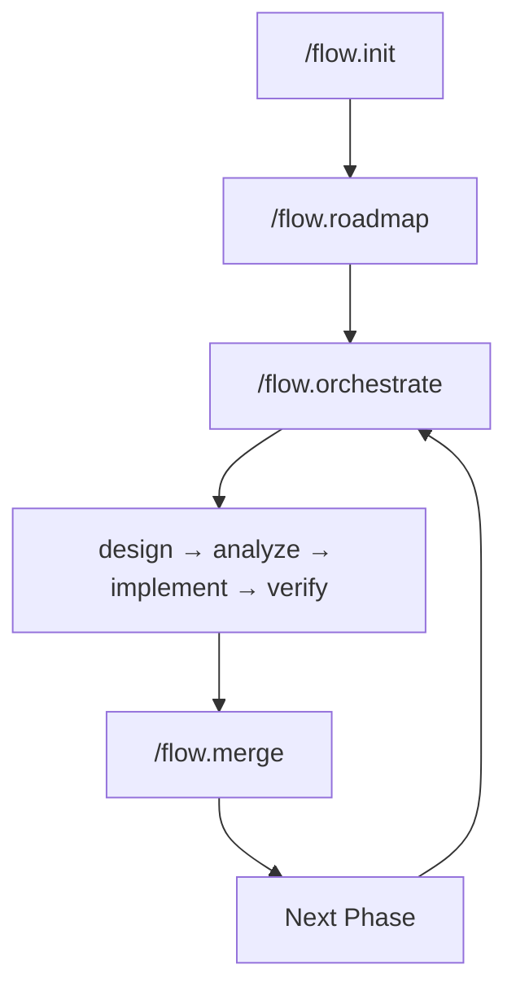

<p align="center">
  <h1 align="center">SpecFlow</h1>
  <p align="center">
    Spec-driven development framework for <a href="https://claude.ai/code">Claude Code</a>
    <br />
    <em>Structure requirements. Generate specs. Orchestrate implementation.</em>
  </p>
</p>

<p align="center">
  <a href="https://github.com/wiseyoda/claude-specflow-orchestration/actions/workflows/test.yml"></a>
  <a href="LICENSE"></a>
  <a href="#requirements"></a>
</p>

---

## Why SpecFlow?

Building software with AI assistants works best with structure. SpecFlow provides:

- **Guided requirements gathering** - Never miss critical decisions
- **Consistent artifacts** - Specs, plans, and tasks that work together
- **Automated workflows** - From requirements to merged PR in one command
- **State persistence** - Resume anywhere, track progress across sessions
- **Quality gates** - Validation at every stage

---

## Table of Contents

- [Install](#install)
- [Quick Start](#quick-start)
- [How It Works](#how-it-works)
- [Commands](#commands)
- [Documentation](#documentation)
- [Requirements](#requirements)
- [Contributing](#contributing)
- [Support](#support)

---

## Install

```bash
git clone https://github.com/wiseyoda/claude-specflow-orchestration.git
cd claude-specflow-orchestration
./install.sh
```

Add to your shell profile (`~/.bashrc` or `~/.zshrc`):

```bash
export PATH="$HOME/.claude/specflow-system/bin:$PATH"
```

Verify:

```bash
specflow --version
specflow status
```

---

## Quick Start

**1. Initialize your project in Claude Code:**

```
/flow.init
```

**2. Create your roadmap:**

```
/flow.roadmap
```

**3. Start development:**

```
/flow.orchestrate
```

SpecFlow guides you through design → analyze → implement → verify.

---

## How It Works



SpecFlow manages the full development lifecycle:

| Stage | What Happens |
|-------|--------------|
| **Init** | Discovery interview captures requirements and decisions |
| **Roadmap** | Break work into phased milestones |
| **Orchestrate** | Automated workflow: design → analyze → implement → verify |
| **Merge** | Push, create PR, merge, cleanup branches |

---

## Commands

SpecFlow has two interfaces:

| Interface | Syntax | Purpose |
|-----------|--------|---------|
| **CLI** | `specflow <cmd>` | State management, task tracking, phase lifecycle |
| **Slash** | `/flow.<cmd>` | AI-assisted development workflows |

### CLI Commands

```bash
specflow status              # Complete project status
specflow next                # Next actionable task
specflow mark T007           # Mark task complete
specflow check --fix         # Validation with auto-fix
specflow phase open 0020     # Start a phase
specflow phase close         # Close current phase
specflow phase defer "item"  # Defer to backlog
```

### Slash Commands

| Command | Description |
|---------|-------------|
| `/flow.init` | Initialize project with discovery interview |
| `/flow.orchestrate` | Full automated workflow |
| `/flow.design` | Create all design artifacts |
| `/flow.implement` | Execute tasks with TDD |
| `/flow.verify` | Verify completion |
| `/flow.merge` | Push, PR, merge to main |
| `/flow.roadmap` | Create/update ROADMAP |
| `/flow.memory` | Manage memory documents |
| `/flow.review` | Systematic code review |

### Full References

- **[CLI Reference](docs/cli-reference.md)** - 6 smart CLI commands
- **[Slash Commands](docs/slash-commands.md)** - 10 slash commands

---

## Documentation

| Guide | Description |
|-------|-------------|
| [CLI Reference](docs/cli-reference.md) | Complete CLI command reference |
| [Slash Commands](docs/slash-commands.md) | All slash commands and options |
| [Project Structure](docs/project-structure.md) | Directory layout and key files |
| [Templates](docs/templates.md) | Customizing document templates |
| [Configuration](docs/configuration.md) | State files and settings |
| [Troubleshooting](docs/troubleshooting.md) | Common issues and solutions |
| [Integration Guide](docs/integration-guide.md) | Working with existing documentation |

---

## Requirements

| Dependency | Version | Install |
|------------|---------|---------|
| [Claude Code](https://claude.ai/code) | Latest | [Download](https://claude.ai/code) |
| Node.js | 18+ | Required for TypeScript CLI |
| pnpm | 8+ | `npm install -g pnpm` |
| git | 2.0+ | Usually pre-installed |

---

## Development

```bash
# Install dependencies
pnpm install

# Build CLI
pnpm --filter @specflow/cli build

# Run tests
pnpm --filter @specflow/cli test

# Run CLI
specflow status
```

---

## Upgrade

```bash
cd claude-specflow-orchestration
git pull
./install.sh --upgrade
pnpm --filter @specflow/cli build
```

---

## Contributing

Contributions are welcome! See [ROADMAP.md](ROADMAP.md) for current development priorities.

1. Fork the repository
2. Create a feature branch (`git checkout -b feature/amazing-feature`)
3. Make your changes
4. Run tests (`pnpm --filter @specflow/cli test`)
5. Submit a Pull Request

---

## Support

- **Issues**: [GitHub Issues](https://github.com/wiseyoda/claude-specflow-orchestration/issues)
- **Discussions**: [GitHub Discussions](https://github.com/wiseyoda/claude-specflow-orchestration/discussions)

---

## License

MIT - See [LICENSE](LICENSE) for details.
