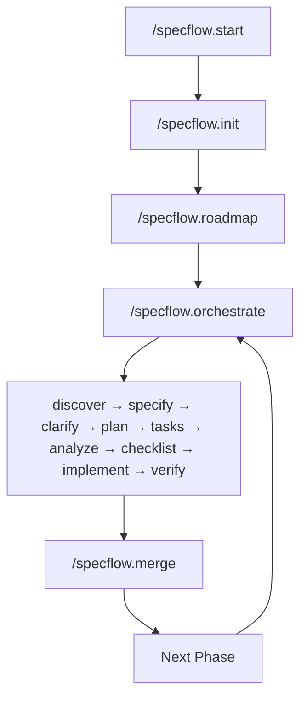

<p align="center">
  <h1 align="center">SpecFlow</h1>
  <p align="center">
    Spec-driven development framework for <a href="https://claude.ai/code">Claude Code</a>
    <br />
    <em>Structure requirements. Generate specs. Orchestrate implementation.</em>
  </p>
</p>

<p align="center">
  <a href="https://github.com/wiseyoda/claude-specflow-orchestration/actions/workflows/test.yml"></a>
  <a href="LICENSE"></a>
  <a href="#requirements"></a>
  <a href="#requirements"></a>
</p>

---

## Why SpecFlow?

Building software with AI assistants works best with structure. SpecFlow provides:

- **Guided requirements gathering** - Never miss critical decisions
- **Consistent artifacts** - Specs, plans, and tasks that work together
- **Automated workflows** - From requirements to merged PR in one command
- **State persistence** - Resume anywhere, track progress across sessions
- **Quality gates** - Validation at every stage

---

## Table of Contents

- [Install](#install)
- [Quick Start](#quick-start)
- [How It Works](#how-it-works)
- [Commands](#commands)
- [Documentation](#documentation)
- [Requirements](#requirements)
- [Contributing](#contributing)
- [Support](#support)

---

## Install

```bash
git clone https://github.com/wiseyoda/claude-specflow-orchestration.git
cd claude-specflow-orchestration
./install.sh
```

Add to your shell profile (`~/.bashrc` or `~/.zshrc`):

```bash
export PATH="$HOME/.claude/specflow-system/bin:$PATH"
```

Verify:

```bash
specflow doctor
```

---

## Quick Start

**1. Initialize your project:**

```bash
cd your-project
specflow scaffold
```

**2. Start in Claude Code:**

```
/specflow.start
```

That's it. SpecFlow detects your project state and guides you to the next step.

---

## How It Works



SpecFlow manages the full development lifecycle:

| Stage | What Happens |
|-------|--------------|
| **Init** | Interactive interview captures requirements and decisions |
| **Roadmap** | Break work into phased milestones |
| **Orchestrate** | Automated workflow: discover → specify → clarify → plan → tasks → analyze → checklist → implement → verify |
| **Merge** | Push, create PR, merge, cleanup branches |

---

## Commands

SpecFlow has two interfaces:

| Interface | Syntax | Purpose |
|-----------|--------|---------|
| **CLI** | `specflow <cmd>` | Setup, diagnostics, state management |
| **Slash** | `/specflow.<cmd>` | AI-assisted development workflows |

### Essential Commands

| Command | Description |
|---------|-------------|
| `specflow scaffold` | Create `.specify/` project structure |
| `specflow doctor` | Verify installation and project health |
| `specflow dashboard` | Start web dashboard for project management |
| `/specflow.start` | Smart entry point—detects state, suggests next step |
| `/specflow.orchestrate` | Full automated workflow with state persistence |
| `/specflow.merge` | Complete phase: push, PR, merge, cleanup |

### All Commands

See the full reference guides:
- **[CLI Reference](docs/cli-reference.md)** - 30+ CLI commands
- **[Slash Commands](docs/slash-commands.md)** - 20 slash commands

### Web Dashboard

SpecFlow includes a web dashboard for visual project management:

```bash
specflow dashboard          # Start on port 3000
specflow dashboard --dev    # Development mode with hot reload
specflow dashboard --port 8080  # Custom port
```

The dashboard shows all registered SpecFlow projects, with dark mode support and keyboard navigation (⌘K for command palette).

---

## Documentation

| Guide | Description |
|-------|-------------|
| [CLI Reference](docs/cli-reference.md) | Complete CLI command reference |
| [Slash Commands](docs/slash-commands.md) | All slash commands and options |
| [Project Structure](docs/project-structure.md) | Directory layout and key files |
| [Templates](docs/templates.md) | Customizing document templates |
| [Configuration](docs/configuration.md) | State files and settings |
| [Troubleshooting](docs/troubleshooting.md) | Common issues and solutions |
| [Integration Guide](docs/integration-guide.md) | Importing existing documentation |

---

## Requirements

| Dependency | Version | Install |
|------------|---------|---------|
| [Claude Code](https://claude.ai/code) | Latest | [Download](https://claude.ai/code) |
| jq | 1.5+ | `brew install jq` / `apt install jq` |
| git | 2.0+ | Usually pre-installed |
| Bash | 3.2+ | macOS default works |

---

## Upgrade

```bash
cd claude-specflow-orchestration
git pull
./install.sh --upgrade
```

---

## Contributing

Contributions are welcome! See [ROADMAP.md](ROADMAP.md) for current development priorities.

1. Fork the repository
2. Create a feature branch (`git checkout -b feature/amazing-feature`)
3. Make your changes
4. Verify installation (`./install.sh --check`)
5. Submit a Pull Request

---

## Support

- **Issues**: [GitHub Issues](https://github.com/wiseyoda/claude-specflow-orchestration/issues)
- **Discussions**: [GitHub Discussions](https://github.com/wiseyoda/claude-specflow-orchestration/discussions)

---

## License

MIT - See [LICENSE](LICENSE) for details.
