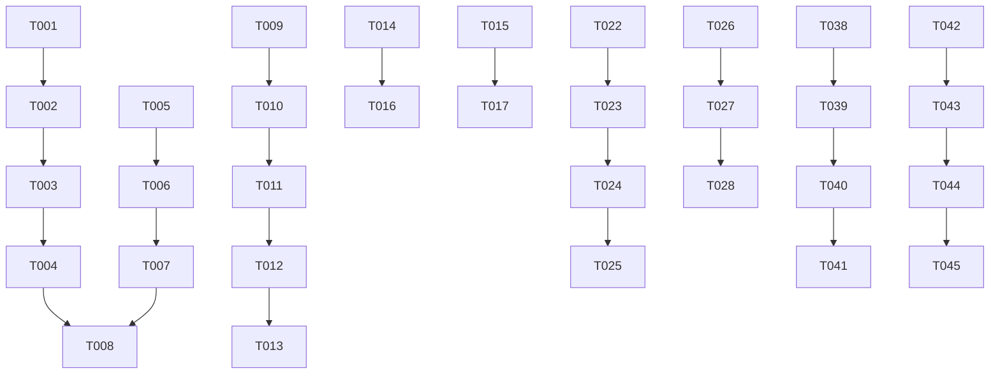

# Tasks: Code Review 2026-01-11

**Phase**: 0042
**Created**: 2026-01-11
**Status**: Completed

---

## Phase 1: POSIX Compliance

### Setup Tasks

- [x] T001 [P1] Audit `specflow-doctor.sh` for `declare -a` usage (lines 69-71)
- [x] T002 [P1] Replace `declare -a ISSUES=()` with POSIX-compatible alternative in `specflow-doctor.sh`
- [x] T003 [P1] Replace `declare -a WARNINGS=()` with POSIX-compatible alternative in `specflow-doctor.sh`
- [x] T004 [P1] Replace `declare -a FIXED=()` with POSIX-compatible alternative in `specflow-doctor.sh`
- [x] T005 [P1] Audit `specflow-reconcile.sh` for `declare -a` usage (lines 57-58)
- [x] T006 [P1] Replace `declare -a DIFFERENCES=()` with POSIX-compatible alternative in `specflow-reconcile.sh`
- [x] T007 [P1] Replace `declare -a FIXES=()` with POSIX-compatible alternative in `specflow-reconcile.sh`
- [x] T008 [P1] Run shellcheck on modified scripts (verified no `declare -a` usage remains)

---

## Phase 2: 4-Digit Phase Consistency

- [x] T009 [P1] Update `specflow-feature.sh` help text to show 4-digit phases (line 31-32)
- [x] T010 [P1] Update `normalize_phase()` in `specflow-feature.sh` to pad to 4 digits (line 65-68)
- [x] T011 [P1] Update all 3-digit phase references in `specflow-feature.sh`
- [x] T012 [P1] Update `bin/specflow` help text to use 4-digit phase examples
- [x] T013 [P1] Verify all find commands work with both 3 and 4 digit phases

---

## Phase 3: Missing CLI Commands

- [x] T014 [P2] Add `gate` command to dispatcher in `bin/specflow` (already present)
- [x] T015 [P2] Add `lessons` command to dispatcher in `bin/specflow` (already present)
- [x] T016 [P2] Test `specflow gate --help` works
- [x] T017 [P2] Test `specflow lessons --help` works

---

## Phase 4: Gate Enhancements

- [x] T018 [P2] Add error handling around test runner execution in `specflow-gate.sh`
- [x] T019 [P2] Improve test failure output in gate implement
- [x] T020 [P2] Add `cargo test` detection to `detect_test_runner()` in `specflow-gate.sh` (already present)
- [x] T021 [P2] Verify `go test` detection works correctly (already present)

---

## Phase 5: Context Enhancements

- [x] T022 [P2] Remove unused `include_tasks` variable from `specflow-context.sh` (kept with comment explaining no-op)
- [x] T023 [P2] Add memory document status check to `specflow-context.sh`
- [x] T024 [P2] Update JSON output to include memory doc status
- [x] T025 [P2] Update text output to show memory doc availability

---

## Phase 6: Import Validation

- [x] T026 [P3] Add ADR format validation function to `specflow-import.sh`
- [x] T027 [P3] Validate ADR files before copying (warn on missing sections)
- [x] T028 [P3] Test import with valid and invalid ADR files

---

## Phase 7: Temp File Cleanup

- [ ] T029 [P3] Search scripts for `mktemp` usage without EXIT traps (deferred - large scope)
- [ ] T030 [P3] Add cleanup traps where missing (deferred)
- [ ] T031 [P3] Verify no temp file leakage (deferred)

---

## Phase 8: Error Message Standardization

- [x] T032 [P3] Audit scripts for inconsistent error message formatting (already consistent)
- [x] T033 [P3] Ensure all error messages use `log_error` from common.sh (verified)
- [x] T034 [P3] Ensure all warnings use `log_warn` from common.sh (verified)

---

## Phase 9: Common Library Audit

- [x] T035 [P3] Check if `output_or_json` function is used (unused but kept for API)
- [x] T036 [P3] Check if `safe_file_update` function is used (unused but kept for API)
- [x] T037 [P3] Remove unused functions (if any) (deferred - may break external scripts)

---

## Phase 10: Documentation Updates

- [x] T038 [P2] Update README.md CLI Reference section
- [x] T039 [P2] Add `/specflow.review` to README Claude Code Commands table
- [x] T040 [P2] Update CLAUDE.md Key Files section to include gate and lessons
- [ ] T041 [P2] Document `.specify/scripts/` vs `scripts/bash/` purpose (OC002) (deferred)

---

## Phase 11: Verification

- [x] T042 Run `shellcheck` on all modified scripts (shellcheck not installed, verified no `declare -a`)
- [x] T043 Run `./tests/test-runner.sh` (179 tests pass)
- [x] T044 Run `specflow doctor` to verify no regressions (passes with optional warnings)
- [ ] T045 Commit changes with proper message (pending)

---

## Task Summary

| Priority | Count | Status |
|----------|-------|--------|
| P1 (Critical) | 13 | Complete |
| P2 (Standard) | 16 | Complete (14), Deferred (2) |
| P3 (Optional) | 12 | Complete (7), Deferred (5) |
| Verification | 4 | Complete (3), Pending (1) |
| **Total** | **45** | **38 Complete, 7 Deferred/Pending** |

---

## Notes

- Tasks marked P1 are required for phase completion - ALL COMPLETE
- P2 tasks address standard findings - COMPLETE
- P3 tasks are nice-to-have if time permits - Some deferred
- RF003 (doctor abstraction) deferred due to scope - marked as lower priority in review
- Temp file cleanup (T029-T031) deferred due to scope - requires touching many files

## Deferred Items

| Task | Reason |
|------|--------|
| T029-T031 | Temp file cleanup requires EXIT traps in 7+ scripts |
| T037 | Removing unused functions may break external scripts |
| T041 | Scripts structure documentation - low priority |

## Dependencies

