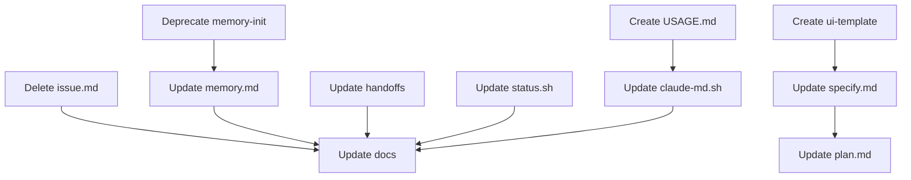

# Implementation Plan: UX Simplification

**Phase**: 0050
**Version**: 1.0.0
**Created**: 2026-01-11

---

## 1. Technical Context

### 1.1 Current State Analysis

**Already Completed** (from recent commits):
- `.specify/scripts/bash/` directory deleted (commit 0595082)
- No orphaned scripts to remove - FR-001 is already done

**Files to Modify**:
| Category | Count | Files |
|----------|-------|-------|
| Slash Commands | 12 | speckit.{issue,memory,memory-init,specify,plan,init,orchestrate,verify,merge,backlog,review,roadmap,constitution,phase}.md |
| Docs | 8 | cli-reference, slash-commands, integration-guide, project-structure, configuration, troubleshooting, templates, COMMAND-AUDIT.md |
| CLI | 2 | bin/speckit, scripts/bash/speckit-status.sh |
| Templates | 2 | CLAUDE.md template, new ui-design-template.md |
| New Files | 1 | .specify/USAGE.md template |

### 1.2 Handoff Pattern

Slash commands use YAML frontmatter for handoffs:
```yaml
handoffs:
  - label: "Button Text"
    agent: speckit.target
    prompt: "Context for next command"
    send: true  # Optional: marks as default
```

All handoffs should include `/speckit.start` as an option for "Continue Later".

### 1.3 Constitution Compliance Check

| Principle | Compliance | Notes |
|-----------|------------|-------|
| I. Developer Experience First | ✅ | Entry point consolidation improves UX |
| II. POSIX-Compliant Bash | ✅ | No new bash scripts, only markdown |
| III. CLI Over Direct Edits | ✅ | Using speckit commands for state |
| IV. Simplicity Over Cleverness | ✅ | Removing complexity, not adding |
| V. Helpful Error Messages | ✅ | Deprecation errors include next steps |
| VI. Graceful Degradation | ✅ | No feature removal |
| VII. Three-Line Output Rule | ✅ | No CLI output changes |

---

## 2. Implementation Approach

### Phase 2.1: Delete/Deprecate (Quick Wins)

**Task Group**: Code cleanup and deprecation

1. **Delete `/speckit.issue` slash command**
   - File: `commands/speckit.issue.md`
   - Action: DELETE file
   - Reason: CLI `speckit issue` works directly

2. **Deprecate `/speckit.memory-init`**
   - File: `commands/speckit.memory-init.md`
   - Action: REPLACE with error message pointing to `/speckit.memory generate`
   - Pattern:
     ```markdown
     ## DEPRECATED

     This command has been consolidated into `/speckit.memory`.

     **Use Instead**: `/speckit.memory generate`

     The `generate` subcommand provides the same functionality.
     ```

### Phase 2.2: Memory Command Consolidation

**Task Group**: Unify memory commands

1. **Update `/speckit.memory` to handle `generate` subcommand**
   - File: `commands/speckit.memory.md`
   - Add: Section for `generate` subcommand that:
     - Detects project type
     - Generates memory documents
     - Same functionality as old memory-init

### Phase 2.3: Handoff Updates

**Task Group**: Point all handoffs to `/speckit.start`

Commands to update (add "Continue Later" handoff):
1. `speckit.init.md`
2. `speckit.orchestrate.md`
3. `speckit.verify.md`
4. `speckit.merge.md`
5. `speckit.backlog.md`
6. `speckit.review.md`
7. `speckit.roadmap.md`
8. `speckit.constitution.md`
9. `speckit.phase.md`
10. `speckit.specify.md`
11. `speckit.plan.md`

Pattern to add to each:
```yaml
handoffs:
  # ... existing handoffs ...
  - label: "Continue Later"
    agent: speckit.start
    prompt: "Resume work on this project"
```

### Phase 2.4: UI Design Artifacts

**Task Group**: Add UI detection and design documentation

1. **Create UI design template**
   - File: `templates/ui-design-template.md`
   - Content: Before/After/Rationale/Components structure

2. **Update `/speckit.specify` for UI detection**
   - File: `commands/speckit.specify.md`
   - Add: UI keyword detection logic
   - Add: Auto-create `specs/XXXX/ui/design.md` for UI phases
   - Keywords: dashboard, form, button, screen, page, view, component, interface, modal, dialog, panel, widget, layout, navigation, menu, sidebar, header, footer

3. **Update `/speckit.plan` for UI verification**
   - File: `commands/speckit.plan.md`
   - Add: Check if UI phase, verify design.md exists

### Phase 2.5: Documentation Overhaul

**Task Group**: Comprehensive documentation updates

1. **README.md**
   - Add prominent `/speckit.start` recommendation
   - Update quick start section

2. **bin/speckit help text**
   - Add note about `/speckit.start` entry point
   - Keep existing error handling for slash command confusion

3. **docs/ folder updates**:
   - `cli-reference.md` - Verify current, remove /speckit.issue reference
   - `slash-commands.md` - Add `/speckit.start` prominence, remove /speckit.issue
   - `integration-guide.md` - Update workflow examples
   - `project-structure.md` - Verify accuracy
   - `configuration.md` - Verify accuracy
   - `troubleshooting.md` - Update with current diagnostics
   - `templates.md` - Verify accuracy, add ui-design-template reference
   - `COMMAND-AUDIT.md` - Mark /speckit.issue as DELETED, update status

### Phase 2.6: CLAUDE.md Split

**Task Group**: Minimize CLAUDE.md, create USAGE.md

1. **Create `.specify/USAGE.md` template**
   - Full CLI reference
   - Syntax notes (key=value patterns)
   - Common patterns
   - Troubleshooting

2. **Update CLAUDE.md template in `speckit claude-md merge`**
   - Minimal SpecKit section (~10 lines):
     ```markdown
     ## SpecKit

     This project uses SpecKit for spec-driven development.

     **Quick Start**: `/speckit.start` - routes to the right command
     **CLI Help**: `speckit --help`
     **Full Reference**: `.specify/USAGE.md`
     ```

### Phase 2.7: State Derivation

**Task Group**: Filesystem-based state detection

1. **Update `scripts/bash/speckit-status.sh`**
   - Add artifact existence checks
   - Derive step completion from:
     - specify: `spec.md` exists
     - clarify: no `[NEEDS CLARIFICATION]` markers
     - plan: `plan.md` exists
     - tasks: `tasks.md` exists
     - analyze: no analyze markers
     - checklist: `checklists/verification.md` exists
     - implement: all task checkboxes marked
     - verify: ROADMAP shows complete

---

## 3. File Change Summary

### 3.1 Files to DELETE

| File | Reason |
|------|--------|
| `commands/speckit.issue.md` | CLI works directly |

### 3.2 Files to CREATE

| File | Purpose |
|------|---------|
| `templates/ui-design-template.md` | UI design documentation template |
| `.specify/USAGE.md` (template) | Full CLI reference for target projects |

### 3.3 Files to MODIFY

| File | Changes |
|------|---------|
| `commands/speckit.memory.md` | Add `generate` subcommand |
| `commands/speckit.memory-init.md` | Replace with deprecation message |
| `commands/speckit.specify.md` | Add UI detection, handoff |
| `commands/speckit.plan.md` | Add UI verification, handoff |
| `commands/speckit.{init,orchestrate,verify,merge,backlog,review,roadmap,constitution,phase}.md` | Add "Continue Later" handoff |
| `README.md` | Add /speckit.start prominence |
| `bin/speckit` | Add /speckit.start note in help |
| `scripts/bash/speckit-status.sh` | Add state derivation logic |
| `scripts/bash/speckit-claude-md.sh` | Update merge for minimal section |
| `docs/cli-reference.md` | Remove /speckit.issue |
| `docs/slash-commands.md` | Update command list, add start prominence |
| `docs/integration-guide.md` | Update examples |
| `docs/troubleshooting.md` | Update diagnostics |
| `docs/templates.md` | Add ui-design reference |
| `docs/COMMAND-AUDIT.md` | Update status |

---

## 4. Risk Assessment

| Risk | Mitigation |
|------|------------|
| Breaking existing handoffs | Add handoff, don't replace |
| Memory-init users confused | Clear deprecation message |
| UI detection false positives | Conservative keyword list |
| State derivation errors | Fallback to stored state |

---

## 5. Testing Strategy

1. **Pre-implementation**: Verify `/speckit.issue` CLI works
2. **Post-deprecation**: Verify `/speckit.memory-init` shows error message
3. **Post-consolidation**: Verify `/speckit.memory generate` works
4. **Post-handoffs**: Spot-check 2-3 commands for "Continue Later"
5. **Post-UI**: Create test UI phase, verify design.md created
6. **Post-docs**: Manual review of all updated files

---

## 6. Dependencies



**Parallelizable Work**:
- Group 1: Delete issue.md, Deprecate memory-init, Update handoffs
- Group 2: Create ui-template, Update specify/plan
- Group 3: Update status.sh, Create USAGE.md
- Group 4: All docs updates (after Groups 1-3)
